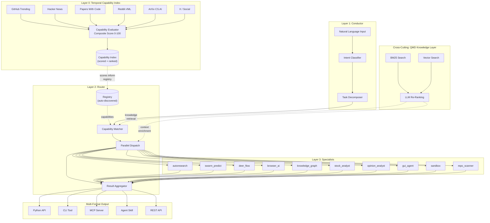

# 003-AT-ARCH: Conductor-Router-Specialists Architecture

**Project:** OSS Agent Lab
**Version:** 1.0
**Date:** 2026-03-16
**Author:** Jeremy Longshore
**Status:** Draft

---

## Overview

OSS Agent Lab uses a 4-layer architecture: a Temporal Capability Index that discovers and scores repos, a Conductor that interprets natural language, a Router that dispatches to the right specialists, and Specialists that wrap upstream repos into standardized capabilities. A cross-cutting QMD knowledge layer provides hybrid retrieval across all layers.

This document defines the architecture, data flow, contract schemas, auto-discovery mechanism, and multi-format output pipeline.

---

## System Architecture



---

## Layer Descriptions

### Layer 0: Temporal Capability Index

**Location:** `scoring/`

The Temporal Capability Index is the discovery engine. It continuously scrapes 6+ sources for trending AI repositories and computes a composite Capability Score (0-100) for each.

**Sources:**

| Source | Signal | Scraper Location |
|--------|--------|-----------------|
| GitHub Trending | Star velocity, fork rate, new repo detection | `scoring/sources/github_trending.py` |
| Hacker News | Points, comment count, front-page duration | `scoring/sources/hackernews.py` |
| Papers With Code | Paper-repo links, benchmark results | `scoring/sources/papers_with_code.py` |
| Reddit r/MachineLearning | Upvotes, cross-posts, comment engagement | `scoring/sources/reddit.py` |
| ArXiv CS.AI | New listings, citation velocity | `scoring/sources/arxiv.py` |
| X / Social Signals | Mentions, engagement rate, influencer amplification | `scoring/sources/social.py` |

**Scoring Weights:**

| Signal Group | Weight | Components |
|-------------|--------|------------|
| Discovery | 40% | Star velocity, social mentions, HN points, Reddit upvotes |
| Quality | 35% | Documentation coverage, test presence, CI status, issue response time |
| Durability | 25% | Commit frequency, contributor count, license compatibility, dependency health |

**Score Thresholds:**

| Score | Action |
|-------|--------|
| 80+ | Auto-scaffold a new specialist via repo_scanner |
| 60-79 | Flag for manual evaluation |
| 40-59 | Add to watch list |
| <40 | Skip |

The index is temporal: it tracks score changes over time, detects velocity spikes, and can identify repos whose scores are decaying (signal for deprecation) or accelerating (signal for priority wrapping).

**Key file:** `scoring/scorer.py` -- composite scorer entry point
**Key file:** `scoring/temporal.py` -- temporal tracking and velocity detection

### Layer 1: Conductor

**Location:** `agents/conductor/`

The Conductor is the user-facing entry point. It accepts natural language input, classifies the user's intent, and decomposes complex queries into independent sub-tasks that can be dispatched in parallel.

**Components:**

| Component | Responsibility | Implementation |
|-----------|---------------|----------------|
| NL Input Handler | Accept and validate natural language queries | `agents/conductor/agent.py` |
| Intent Classifier | Classify query into intent categories with confidence scores | Claude Agent SDK tool |
| Task Decomposer | Break multi-part queries into independent sub-tasks | Claude Agent SDK tool |

**Intent Categories:**

- `research` -- Questions requiring investigation (routes to autoresearch, deer_flow)
- `predict` -- Questions about future outcomes (routes to swarm_predict)
- `analyze` -- Questions requiring data analysis (routes to stock_analyst, opinion_analyst)
- `execute` -- Tasks requiring action (routes to browser_ai, gui_agent, sandbox)
- `discover` -- Questions about the repo landscape (routes to repo_scanner, knowledge_graph)
- `composite` -- Multi-intent queries that decompose into sub-tasks

**Decomposition example:**

```
Input: "Should I invest in this AI startup?"

Decomposed sub-tasks:
  1. [research] "What is the AI startup's technology and market position?"
  2. [analyze]  "What are the financial signals for this sector?"
  3. [predict]  "What is the consensus prediction for this market segment?"
  4. [analyze]  "What is the sentiment around this startup on social platforms?"
```

Each sub-task is independently routable and can execute in parallel.

### Layer 2: Router

**Location:** `agents/router/`

The Router matches sub-tasks to specialists using the Registry's capability index, dispatches to one or more specialists in parallel, and aggregates their responses into a unified result.

**Components:**

| Component | Responsibility | Implementation |
|-----------|---------------|----------------|
| Registry | Auto-discovers specialists, maintains capability index | `agents/router/registry.py` |
| Capability Matcher | Matches sub-task intents to specialist capabilities | `agents/router/agent.py` |
| Dispatch Engine | Parallel execution of specialist requests | `agents/router/agent.py` |
| Result Aggregator | Combines specialist responses, resolves conflicts, cites sources | `agents/router/agent.py` |

**Matching Algorithm:**

1. Parse sub-task intent and extract required capabilities
2. Query Registry for specialists whose declared capabilities match
3. Rank matches by (a) capability relevance score and (b) Temporal Capability Index score of the underlying repo
4. Select top-N specialists (default: top-3 per sub-task)
5. Dispatch in parallel with timeout enforcement

**Aggregation Strategy:**

- **Single specialist:** Return response directly with source attribution
- **Multiple specialists, same domain:** Merge responses, flag contradictions, present consensus view
- **Multiple specialists, different domains:** Concatenate with section headers per specialist
- **Conflict resolution:** When specialists disagree, present both views with confidence scores and let the consumer decide

### Layer 3: Specialists

**Location:** `agents/specialists/`

Each specialist is a self-contained module that wraps one or more upstream open-source repositories. All specialists follow the template pattern defined in `agents/specialists/_template/`.

**Required files per specialist:**

| File | Purpose |
|------|---------|
| `agent.py` | Core logic wrapping the upstream repo, Claude Agent SDK agent definition |
| `tools.py` | Tool definitions for framework integration (MCP, Skills, etc.) |
| `SKILL.md` | Structured YAML+Markdown manifest declaring capabilities, tools, and metadata |
| `README.md` | Human-readable documentation with usage examples for all output formats |

**Specialist lifecycle:**

1. **Discovery:** Registry scans `agents/specialists/` for directories containing `SKILL.md`
2. **Registration:** SKILL.md is parsed; capabilities, tools, and metadata are indexed
3. **Dispatch:** Router sends a `SpecialistRequest` to the specialist's agent
4. **Execution:** Specialist processes the request using upstream repo logic
5. **Response:** Specialist returns a `SpecialistResponse` conforming to contract schema

### Cross-Cutting: QMD Knowledge Layer

**Location:** `agents/memory/`

The QMD knowledge layer provides hybrid retrieval across the entire system. It combines three retrieval strategies for maximum recall and precision.

**Retrieval Pipeline:**

| Stage | Method | Purpose |
|-------|--------|---------|
| 1 | BM25 Search | Fast keyword-based retrieval for exact term matches |
| 2 | Vector Search | Semantic similarity for conceptual matches |
| 3 | LLM Re-Ranking | Final relevance scoring using LLM judgment |

**Integration Points:**

- **Capability Matcher:** Knowledge layer provides context about specialist capabilities beyond what SKILL.md declares (e.g., past performance, common query patterns)
- **Dispatch Engine:** Enriches specialist requests with relevant context from previous sessions and cross-specialist knowledge
- **Specialists:** Each specialist can query the knowledge layer for domain-specific information
- **Temporal Index:** Knowledge layer indexes scoring history for trend analysis queries

---

## Data Flow

### Primary Query Flow

```
User Query (natural language)
    │
    ▼
┌─────────────────────────────┐
│  CONDUCTOR                  │
│  1. Parse input             │
│  2. Classify intent         │
│  3. Decompose into tasks    │
└─────────────┬───────────────┘
              │ List[SubTask]
              ▼
┌─────────────────────────────┐
│  ROUTER                     │
│  4. Match capabilities      │
│  5. Select specialists      │
│  6. Dispatch in parallel    │
└──────┬──────┬──────┬────────┘
       │      │      │  SpecialistRequest (per specialist)
       ▼      ▼      ▼
   ┌──────┐┌──────┐┌──────┐
   │ SP-A ││ SP-B ││ SP-C │  (parallel execution)
   └──┬───┘└──┬───┘└──┬───┘
      │       │       │  SpecialistResponse (per specialist)
      ▼       ▼       ▼
┌─────────────────────────────┐
│  AGGREGATOR                 │
│  7. Merge responses         │
│  8. Resolve conflicts       │
│  9. Cite sources            │
│  10. Format output          │
└─────────────┬───────────────┘
              │ AggregatedResponse
              ▼
        Final Response
   (Python / CLI / MCP / Skill / REST)
```

### Latency Budget

| Stage | Target | Notes |
|-------|--------|-------|
| Intent classification | < 500ms | Single LLM call |
| Task decomposition | < 500ms | Single LLM call (may be combined with classification) |
| Capability matching | < 50ms | Local registry lookup |
| Specialist dispatch | < 100ms | Async dispatch overhead |
| Specialist execution | < 1500ms | Varies by specialist; timeout enforced |
| Result aggregation | < 500ms | Single LLM call for multi-specialist merges |
| **Total e2e** | **< 3000ms** | **Warm cache, local execution** |

---

## Contract Schemas

All inter-agent communication uses Pydantic models defined in `agents/contracts/schemas.py`.

### Query

```python
class Query(BaseModel):
    """User-submitted query entering the system."""
    id: str = Field(default_factory=lambda: str(uuid4()))
    text: str
    context: dict[str, Any] = Field(default_factory=dict)
    session_id: str | None = None
    timestamp: datetime = Field(default_factory=datetime.utcnow)
```

### Intent

```python
class Intent(BaseModel):
    """Classified intent from the Conductor."""
    category: Literal[
        "research", "predict", "analyze",
        "execute", "discover", "composite"
    ]
    confidence: float = Field(ge=0.0, le=1.0)
    sub_tasks: list[SubTask] = Field(default_factory=list)
    original_query: Query

class SubTask(BaseModel):
    """A decomposed sub-task routable to a specialist."""
    id: str = Field(default_factory=lambda: str(uuid4()))
    text: str
    intent_category: str
    required_capabilities: list[str] = Field(default_factory=list)
    priority: int = Field(default=0, ge=0, le=10)
```

### SpecialistRequest

```python
class SpecialistRequest(BaseModel):
    """Request dispatched to a specialist by the Router."""
    id: str = Field(default_factory=lambda: str(uuid4()))
    sub_task: SubTask
    specialist_name: str
    context: dict[str, Any] = Field(default_factory=dict)
    timeout_ms: int = Field(default=5000, ge=100, le=30000)
    session_id: str | None = None
```

### SpecialistResponse

```python
class SpecialistResponse(BaseModel):
    """Response returned by a specialist."""
    id: str = Field(default_factory=lambda: str(uuid4()))
    request_id: str
    specialist_name: str
    status: Literal["success", "error", "timeout", "partial"]
    result: dict[str, Any] = Field(default_factory=dict)
    confidence: float = Field(ge=0.0, le=1.0)
    sources: list[str] = Field(default_factory=list)
    duration_ms: int = Field(ge=0)
    error: str | None = None
```

### SessionContext

```python
class SessionContext(BaseModel):
    """Cross-session context managed by the memory layer."""
    session_id: str = Field(default_factory=lambda: str(uuid4()))
    user_id: str | None = None
    history: list[Query] = Field(default_factory=list)
    specialist_results: list[SpecialistResponse] = Field(default_factory=list)
    knowledge_graph_refs: list[str] = Field(default_factory=list)
    created_at: datetime = Field(default_factory=datetime.utcnow)
    updated_at: datetime = Field(default_factory=datetime.utcnow)
```

---

## Auto-Discovery Mechanism

The Registry auto-discovers specialists without manual configuration. This is a core architectural principle: adding a specialist requires only placing files in the correct directory.

### Discovery Process

1. **Scan:** Registry scans `agents/specialists/` for subdirectories (excluding `_template` and directories starting with `.`)
2. **Validate:** Each directory must contain a `SKILL.md` file with valid YAML frontmatter
3. **Parse:** SKILL.md frontmatter is parsed to extract:
   - `name` -- specialist identifier
   - `capabilities` -- list of capability strings
   - `allowed_tools` -- list of tool names
   - `output_formats` -- supported output formats
   - `tier` -- core / experimental / deprecated
4. **Index:** Parsed metadata is added to the in-memory capability index
5. **Refresh:** Registry can be refreshed at runtime (e.g., after repo_scanner adds a new specialist)

### SKILL.md Schema

```yaml
---
name: autoresearch
display_name: AutoResearch Specialist
description: Self-improving research loops
version: 0.1.0
source_repo: karpathy/autoresearch
license: MIT
tier: core
capabilities:
  - hypothesis_generation
  - experiment_design
  - result_analysis
allowed_tools:
  - generate_hypothesis
  - design_experiment
  - analyze_results
  - run_research_loop
output_formats:
  - python_api
  - cli
  - mcp_server
  - agent_skill
  - rest_api
---
```

### Registry API

```python
class Registry:
    def discover(self) -> list[SpecialistMeta]: ...
    def get(self, name: str) -> SpecialistMeta | None: ...
    def match(self, capabilities: list[str]) -> list[SpecialistMeta]: ...
    def refresh(self) -> None: ...
```

---

## Multi-Format Output

Every specialist generates 5 output formats. The output generation pipeline reads the specialist's `agent.py` and `tools.py` definitions and produces each format automatically.

### Format Details

| # | Format | Generated Artifact | Consumer |
|---|--------|--------------------|----------|
| 1 | Python API | Direct import path (`from oss_agent_lab.specialists import X`) | Python applications |
| 2 | CLI Tool | Click-based command (`oss-lab run <specialist> "<query>"`) | Shell scripts, pipelines |
| 3 | MCP Server | Standalone MCP server exposing specialist tools | Claude Desktop, Cursor, MCP clients |
| 4 | Agent Skill | Framework-compatible tool/skill definition | CrewAI, LangChain, AutoGen |
| 5 | REST API | FastAPI endpoint serving specialist capabilities | Any HTTP client, any language |

### Generation Pipeline

```
specialist/
  ├── agent.py        ─┐
  ├── tools.py         ├──→ Output Generator ──→ python_api/
  ├── SKILL.md         │                    ──→ cli/
  └── README.md       ─┘                    ──→ mcp_server/
                                            ──→ agent_skill/
                                            ──→ rest_api/
```

The output generator reads the specialist definition and produces each format. Formats are generated into `output/<specialist_name>/` and validated by CI.

### MCP Server Format

Each specialist's MCP server follows the standard MCP protocol:

```python
# Generated: output/autoresearch/mcp_server.py
from mcp.server import Server

server = Server("autoresearch")

@server.tool()
async def generate_hypothesis(question: str) -> str:
    """Generate testable hypotheses from a research question."""
    ...

@server.tool()
async def design_experiment(hypothesis: str) -> str:
    """Design experimental methodology for a hypothesis."""
    ...
```

### Agent Skill Format

Each specialist's Agent Skill wraps tools in framework-agnostic definitions:

```python
# Generated: output/autoresearch/agent_skill.py
from oss_agent_lab.skills.base import Skill

autoresearch_skill = Skill(
    name="autoresearch",
    description="Self-improving research loops",
    tools=[generate_hypothesis, design_experiment, analyze_results],
)
```

---

## Directory Structure

```
oss-agent-lab/
├── agents/
│   ├── conductor/
│   │   └── agent.py              # Conductor agent (Layer 1)
│   ├── router/
│   │   ├── agent.py              # Router agent (Layer 2)
│   │   └── registry.py           # Auto-discovery registry
│   ├── contracts/
│   │   └── schemas.py            # Pydantic contract schemas
│   ├── memory/
│   │   └── ...                   # cognee-based knowledge layer
│   └── specialists/
│       ├── _template/            # Specialist template
│       ├── autoresearch/         # Specialist #1
│       ├── swarm_predict/        # Specialist #2
│       ├── deer_flow/            # Specialist #3
│       ├── browser_ai/           # Specialist #4
│       ├── knowledge_graph/      # Specialist #5
│       ├── stock_analyst/        # Specialist #6
│       ├── opinion_analyst/      # Specialist #7
│       ├── gui_agent/            # Specialist #8
│       ├── sandbox/              # Specialist #9
│       └── repo_scanner/         # Specialist #10 (meta)
├── scoring/
│   ├── sources/                  # 6 source scrapers
│   ├── scorer.py                 # Composite scoring engine
│   └── temporal.py               # Temporal index
├── output/                       # Generated multi-format outputs
├── src/
│   └── oss_agent_lab/
│       ├── cli.py                # CLI entry point
│       └── ...
├── tests/
├── 000-docs/                     # Project documentation (this file)
└── service/                      # REST API service
```

---

## Design Decisions

### Why 4 layers, not 2?

A simpler architecture (conductor + specialists) would work for small specialist counts. The 4-layer design pays off as the specialist inventory grows:

- **Layer 0** ensures we are always wrapping the *right* repos (freshness over staleness)
- **Layer 1** insulates users from needing to know which specialist to call
- **Layer 2** enables parallel dispatch and intelligent aggregation
- **Layer 3** isolates specialist implementations from each other

### Why auto-discovery instead of a central registry config?

A central config file creates merge conflicts when multiple contributors add specialists simultaneously. Auto-discovery from SKILL.md makes each specialist fully self-contained -- add a directory, get discovered automatically.

### Why 5 output formats?

Each format serves a different consumption pattern. Generating all 5 from a single specialist definition ensures maximum reach without specialist authors needing to maintain multiple implementations.

### Why Pydantic contracts?

Pydantic provides runtime validation, serialization, and IDE autocompletion. Every message between agents is validated at the boundary, catching contract violations early. The schemas also serve as living documentation.
