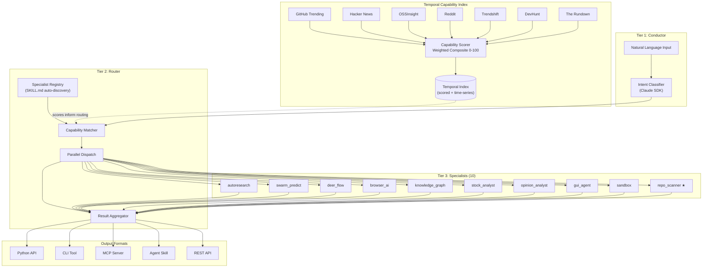

# OSS Agent Lab

**Turn trending repos into instant capabilities for any AI framework.**

[](https://github.com/jeremylongshore/oss-agent-lab/actions/workflows/validate.yml)
[](LICENSE)
[](https://www.python.org/downloads/)
[](https://github.com/anthropics/anthropic-sdk-python)

---

## The Problem

500+ AI repos trend on GitHub every week. Each one is a breakthrough. But:

- **Each has its own API**, its own setup ritual, its own 3-day learning curve.
- **None of them talk to each other.** A research agent can't call a browser agent can't query a knowledge graph.
- **The moment you integrate one, three better alternatives drop.** Your wrapper code rots in days.
- MCP standardized the protocol (97M+ downloads). Skills marketplaces launched (500K+ packages). Frameworks handle orchestration. **But nothing auto-discovers trending repos and makes them instantly usable.**

That last gap is what we build.

---

## What OSS Agent Lab Does

OSS Agent Lab is a **capability factory**. It auto-discovers trending repositories from 7 sources, scores them on a composite 0-100 scale, and wraps the top scorers into **5 output formats**:

| Format | Use Case |
|--------|----------|
| **Python API** | Direct import into any Python project |
| **CLI Tool** | Shell scripting and pipelines |
| **MCP Server** | Any MCP-compatible client (Claude Desktop, Cursor, etc.) |
| **Agent Skill** | Drop into CrewAI, LangChain, or any agent framework |
| **REST API** | Language-agnostic HTTP consumption |

It is **not a framework**. It is a capability factory that amplifies whatever framework you already use.

---

## Architecture



**Layer 0 -- Temporal Capability Index** scrapes 7 sources and computes a weighted composite score for every discovered repo. **Tier 1 -- Conductor** accepts natural language, classifies intent via Claude SDK. **Tier 2 -- Router** matches intent to specialists via a registry that auto-discovers from SKILL.md frontmatter, dispatches in parallel, and aggregates results. **Tier 3 -- Specialists** are plug-and-play wrappers around proven open-source repos. The `repo_scanner` meta-specialist (★) auto-generates new specialists when repos cross the scoring threshold.

---

## Specialist Matrix

| # | Specialist | Wraps | Capabilities |
|---|-----------|-------|-------------|
| 1 | `autoresearch` | [karpathy/autoresearch](https://github.com/karpathy/autoresearch) | Hypothesis generation, experiment design, result analysis |
| 2 | `swarm_predict` | [666ghj/MiroFish](https://github.com/666ghj/MiroFish) | Multi-model swarm predictions, consensus aggregation |
| 3 | `deer_flow` | [bytedance/deer-flow](https://github.com/bytedance/deer-flow) | Research pipelines, code generation, artifact creation |
| 4 | `browser_ai` | [lightpanda-io/browser](https://github.com/nicepkg/gpt-runner) | Headless navigation, content extraction, screenshots |
| 5 | `knowledge_graph` | [GitNexus](https://github.com/abhigyanpatwari/GitNexus) + [cognee](https://github.com/topoteretes/cognee) | Graph construction, relationship queries, Graph RAG |
| 6 | `stock_analyst` | [ai-hedge-fund](https://github.com/virattt/ai-hedge-fund) | Ticker analysis, technical indicators, news sentiment |
| 7 | `opinion_analyst` | [666ghj/BettaFish](https://github.com/666ghj/BettaFish) | Sentiment analysis, stance detection, bias measurement |
| 8 | `gui_agent` | [alibaba/page-agent](https://github.com/anthropics/anthropic-quickstarts) | Element detection, UI interaction, form filling |
| 9 | `sandbox` | [alibaba/OpenSandbox](https://github.com/anthropics/anthropic-quickstarts) | Safe code execution, validation, multi-runtime |
| 10 | `repo_scanner` | META (this repo) | Auto-discovery, repo scoring, specialist scaffolding |

Every specialist follows the same contract (`BaseSpecialist`), produces all 5 output formats, and is independently testable.

---

## Capability Scoring Engine

Every repo in the index gets a **Capability Score** from 0 to 100:

```
Score = 40% Discovery + 35% Quality + 25% Durability
```

| Signal Group | Weight | Sources |
|-------------|--------|---------|
| **Discovery** | 40% | GitHub star velocity, trending position, HN frontpage, DevHunt upvotes, Rundown mentions |
| **Quality** | 35% | README quality, test coverage, API surface clarity, license compatibility, maintenance activity |
| **Durability** | 25% | Contributor diversity, OSSInsight growth curve, Trendshift momentum, dependency health, community depth |

**15 weighted signals** from 7 live sources, computed into a time-series index that detects rising, peaked, and declining repos.

| Score | Action |
|-------|--------|
| **80-100** | Auto-scaffold specialist + priority review |
| **60-79** | Queue for manual evaluation |
| **40-59** | Watch list -- monitor for momentum |
| **< 40** | Skip |

---

## Multi-Format Output

Every specialist generates all 5 formats via `scripts/generate_outputs.py`:

**Python API** -- import and call directly:
```python
from agents.specialists.autoresearch.agent import AutoresearchSpecialist
from oss_agent_lab.contracts import Intent, Query, SpecialistRequest

specialist = AutoresearchSpecialist()
request = SpecialistRequest(
    intent=Intent(action="research", domain="ai", confidence=0.9, parameters={}),
    query=Query(user_input="Latest advances in test-time compute"),
    specialist_name="autoresearch",
)
response = await specialist.execute(request)
print(response.result)
```

**CLI Tool** -- pipe into scripts:
```bash
oss-lab run autoresearch "Latest advances in test-time compute"
```

**MCP Server** -- connect from any MCP client:
```json
{
  "mcpServers": {
    "oss-agent-lab": {
      "command": "python",
      "args": ["-m", "oss_agent_lab.mcp_server"]
    }
  }
}
```

**Agent Skill** -- drop into any framework:
```python
from crewai import Agent
from oss_agent_lab.skills import autoresearch_skill

researcher = Agent(role="Research Analyst", tools=[autoresearch_skill])
```

**REST API** -- call from any language:
```bash
curl -X POST http://localhost:8080/api/v1/run \
  -H "Content-Type: application/json" \
  -d '{"specialist": "autoresearch", "query": "latest advances in test-time compute"}'
```

---

## Quickstart

```bash
# Clone and install
git clone https://github.com/jeremylongshore/oss-agent-lab.git
cd oss-agent-lab
python -m venv .venv && source .venv/bin/activate
pip install -e ".[dev]"

# Run all tests (120+ tests across 10 specialists)
pytest tests/

# Score a GitHub repo
python -c "
import asyncio
from scoring.scorer import score_repo
score = asyncio.run(score_repo('karpathy/autoresearch'))
print(f'{score.repo}: {score.total}/100 -> {score.action}')
"

# Generate outputs for a specialist
python scripts/generate_outputs.py agents/specialists/autoresearch/

# Scaffold a new specialist from a repo
python scripts/generate_specialist.py owner/repo --name my_specialist
```

---

## Where It Sits in the Stack

```
YOUR FRAMEWORK  (CrewAI / LangChain / Claude SDK / AutoGen)
        |
        | consumes capabilities via
        v
MCP SERVERS / AGENT SKILLS  (protocol layer)
        |
        | generated by
        v
OSS AGENT LAB  (the missing auto-wrapping layer)
        |
        | watches + scores
        v
GITHUB TRENDING + 6 MORE SOURCES  (raw frontier signal)
```

Frameworks orchestrate. Protocols standardize. **OSS Agent Lab feeds them both.**

---

## Project Structure

```
oss-agent-lab/
├── src/oss_agent_lab/          # Core library (contracts, base classes)
│   ├── contracts.py            # Pydantic v2 schemas (Query, Intent, Request, Response)
│   └── base.py                 # BaseSpecialist ABC, OutputFormat, Tool
├── agents/
│   ├── conductor/agent.py      # Tier 1: NL → intent classification
│   ├── router/                 # Tier 2: dispatch + aggregation
│   │   ├── agent.py            # RouterAgent
│   │   └── registry.py         # SKILL.md auto-discovery
│   ├── memory/session.py       # Session memory with persistence
│   └── specialists/            # Tier 3: 10 plug-and-play specialists
│       ├── _template/          # Copy this to create a new specialist
│       ├── autoresearch/
│       ├── swarm_predict/
│       ├── deer_flow/
│       ├── browser_ai/
│       ├── knowledge_graph/
│       ├── stock_analyst/
│       ├── opinion_analyst/
│       ├── gui_agent/
│       ├── sandbox/
│       └── repo_scanner/       # Meta-specialist: auto-scaffolds new specialists
├── scoring/                    # Capability Scoring Engine
│   ├── scorer.py               # Weighted composite scorer (15 signals)
│   ├── index.py                # Temporal index with trend detection
│   ├── thresholds.py           # Score → action mapping
│   └── sources/                # 7 source scrapers
├── scripts/
│   ├── generate_outputs.py     # Multi-format wrapper generator
│   └── generate_specialist.py  # Auto-scaffold from template
├── tests/                      # 120+ tests, 85%+ coverage
└── 000-docs/                   # Project documentation (NNN-CC-ABCD filing)
```

---

## Contributing

New specialists are the primary contribution path. Each specialist is a single PR.

1. Copy `agents/specialists/_template/` to `agents/specialists/your_specialist/`
2. Implement four files: `agent.py`, `tools.py`, `SKILL.md`, `__init__.py`
3. Add tests in `tests/test_your_specialist.py`
4. Meet the bar:
   - `BaseSpecialist` contract with `execute()` returning `SpecialistResponse`
   - SKILL.md with required YAML frontmatter (name, version, capabilities, etc.)
   - 80%+ test coverage
   - ruff + mypy clean
5. Open a PR -- CI validates linting, types, tests, coverage, and SKILL.md schema.

**Specialist tiers:**

| Tier | Criteria |
|------|----------|
| **Core** | Ships with v1, maintained by project owner |
| **Verified** | PR reviewed + 80%+ tests + 30 days active maintenance |
| **Community** | PR merged, self-maintained by contributor |
| **Experimental** | In progress, not production-ready |

---

## License

[MIT](LICENSE) -- Copyright (c) 2026 intentsolutions.io

## Author

Jeremy Longshore ([@jeremylongshore](https://github.com/jeremylongshore))
