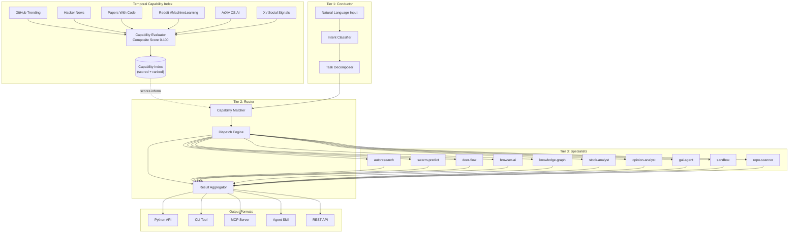

# OSS Agent Lab

**Turn trending repos into instant capabilities for any AI framework.**

[](LICENSE)
[](https://www.python.org/downloads/)
[](https://github.com/anthropics/anthropic-sdk-python)

---

## The Problem

500+ AI repos trend on GitHub every week. Each one is a breakthrough. But:

- **Each has its own API**, its own setup ritual, its own 3-day learning curve.
- **None of them talk to each other.** A research agent can't call a browser agent can't query a knowledge graph.
- **The moment you integrate one, three better alternatives drop.** Your wrapper code rots in days.
- MCP standardized the protocol (97M+ downloads). Skills marketplaces launched (500K+ packages). Frameworks handle orchestration. **But nothing auto-discovers trending repos and makes them instantly usable.**

That last gap is what we build.

---

## What OSS Agent Lab Does

OSS Agent Lab is a **capability factory**. It auto-discovers trending repositories from 6+ sources, scores them on a composite 0-100 scale, and wraps the top scorers into **5 output formats**:

| Format | Use Case |
|--------|----------|
| **Python API** | Direct import into any Python project |
| **CLI Tool** | Shell scripting and pipelines |
| **MCP Server** | Any MCP-compatible client (Claude Desktop, Cursor, etc.) |
| **Agent Skill** | Drop into CrewAI, LangChain, or any agent framework |
| **REST API** | Language-agnostic HTTP consumption |

It is **not a framework**. It is a capability factory that amplifies whatever framework you already use.

---

## Architecture



**Layer 0 -- Temporal Capability Index** continuously scrapes 6+ sources and scores every discovered repo. **Tier 1 -- Conductor** accepts natural language, classifies intent, and decomposes complex queries into sub-tasks. **Tier 2 -- Router** matches sub-tasks to the best-scoring specialists and aggregates their results. **Tier 3 -- Specialists** are plug-and-play wrappers around proven open-source repos.

---

## Specialist Matrix

| # | Specialist | Wraps | What It Does |
|---|-----------|-------|-------------|
| 1 | `autoresearch` | [karpathy/autoresearch](https://github.com/karpathy/autoresearch) | Self-improving research loops -- feed a question, get a paper-grade answer |
| 2 | `swarm-predict` | [666ghj/MiroFish](https://github.com/666ghj/MiroFish) | Swarm intelligence predictions across markets and events |
| 3 | `deer-flow` | [bytedance/deer-flow](https://github.com/bytedance/deer-flow) | Full-stack research + code generation pipelines |
| 4 | `browser-ai` | [lightpanda-io/browser](https://github.com/nicepkg/gpt-runner) | Headless web automation for data extraction and interaction |
| 5 | `knowledge-graph` | GitNexus + [cognee](https://github.com/topoteretes/cognee) | Code knowledge graphs with RAG-powered querying |
| 6 | `stock-analyst` | [ai-hedge-fund](https://github.com/virattt/ai-hedge-fund) + daily_stock | Multi-signal financial analysis and reporting |
| 7 | `opinion-analyst` | [666ghj/BettaFish](https://github.com/666ghj/BettaFish) | Sentiment analysis at scale across social platforms |
| 8 | `gui-agent` | [alibaba/page-agent](https://github.com/anthropics/anthropic-quickstarts) | Natural language control of web UIs |
| 9 | `sandbox` | [alibaba/OpenSandbox](https://github.com/anthropics/anthropic-quickstarts) | Safe, isolated code execution environments |
| 10 | `repo-scanner` | META | Auto-generates new specialist scaffolds from trending repos |

Specialist #10 is the meta-specialist: it watches the Capability Index and proposes new specialists when a repo crosses the auto-scaffold threshold.

---

## Multi-Format Output

Every specialist produces all 5 formats simultaneously. Consume them however fits your stack:

**Python API** -- import directly:
```python
from oss_agent_lab.specialists import autoresearch

result = autoresearch.run("What are the latest advances in test-time compute?")
```

**CLI Tool** -- pipe into scripts:
```bash
oss-agent-lab run autoresearch "latest advances in test-time compute"
```

**MCP Server** -- connect from any MCP client:
```json
{
  "mcpServers": {
    "oss-agent-lab": {
      "command": "python",
      "args": ["-m", "oss_agent_lab.mcp_server"]
    }
  }
}
```

**Agent Skill** -- drop into any framework:
```python
from crewai import Agent
from oss_agent_lab.skills import autoresearch_skill

researcher = Agent(
    role="Research Analyst",
    tools=[autoresearch_skill],
)
```

**REST API** -- call from any language:
```bash
curl -X POST http://localhost:8080/api/v1/run \
  -H "Content-Type: application/json" \
  -d '{"specialist": "autoresearch", "query": "latest advances in test-time compute"}'
```

---

## Quickstart

```bash
git clone https://github.com/jeremylongshore/oss-agent-lab.git
cd oss-agent-lab
pip install -e .
python -m oss_agent_lab "Should I invest in this AI startup?"
```

The Conductor decomposes the query, the Router dispatches to `stock-analyst`, `autoresearch`, and `opinion-analyst` in parallel, and the Aggregator returns a unified, cited response.

---

## Capability Scoring

Every repo in the index gets a **Capability Score** from 0 to 100, computed as:

| Signal Group | Weight | Sources |
|-------------|--------|---------|
| **Discovery** | 40% | GitHub stars velocity, HN points, Reddit upvotes, social mentions |
| **Quality** | 35% | Documentation coverage, test presence, CI status, issue response time |
| **Durability** | 25% | Commit frequency, contributor count, license compatibility, dependency health |

Score thresholds drive automation:

| Score | Action |
|-------|--------|
| **80+** | Auto-scaffold a new specialist |
| **60-79** | Flag for manual evaluation |
| **40-59** | Add to watch list |
| **<40** | Skip |

---

## Where It Sits in the Stack

```
YOUR FRAMEWORK  (CrewAI / LangChain / Claude SDK / AutoGen)
        |
        | consumes
        v
MCP SERVERS / AGENT SKILLS  (protocol layer)
        |
        | generated by
        v
OSS AGENT LAB  (the missing layer -- we build this)
        |
        | watches
        v
GITHUB TRENDING + OSS ECOSYSTEM
```

Frameworks orchestrate. Protocols standardize. **OSS Agent Lab feeds them both.**

---

## Contributing

New specialists are the primary contribution path. Each specialist is a single PR.

1. Copy `agents/specialists/_template/` to `agents/specialists/your_specialist/`
2. Implement the four required files:
   - `agent.py` -- core logic wrapping the upstream repo
   - `tools.py` -- tool definitions for framework integration
   - `SKILL.md` -- structured skill manifest
   - `README.md` -- specialist-level documentation
3. Add tests in `tests/specialists/your_specialist/`
4. Meet the bar:
   - 80%+ test coverage
   - All 5 output formats generated
   - Pydantic schemas from `agents/contracts/schemas.py`
   - MIT-compatible license on the upstream repo
5. Open a PR. The CI pipeline validates coverage, linting, and format generation.

---

## License

[MIT](LICENSE) -- Copyright (c) 2026 intentsolutions.io

## Author

Jeremy Longshore ([@jeremylongshore](https://github.com/jeremylongshore))
